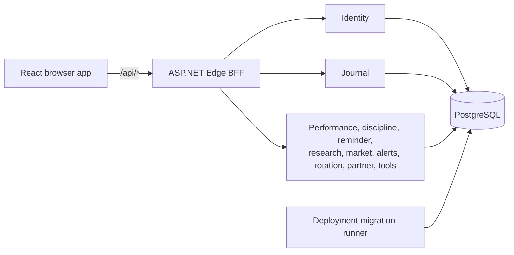

# Micro Cockpit

Micro Cockpit is a diary-first investment decision journal. It helps a user record decisions, trades, reviews, daily performance, research, alerts, and reusable investment calculations without pretending to be a brokerage or portfolio accounting system.

## System at a glance



The browser talks only to Edge. Edge validates JWTs, owns the refresh-cookie boundary, proxies simple operations, and composes screen-shaped responses. Backend services own isolated PostgreSQL schemas and do not write across service boundaries.

## Main modules

| Area | Responsibility | Starting point |
|---|---|---|
| Frontend shell | Routing, authentication gates, responsive navigation, providers | [`frontend/src/main.tsx`](frontend/src/main.tsx), [`frontend/src/App.tsx`](frontend/src/App.tsx) |
| Diary and trades | Diary CRUD, transaction records, reviews, quick notes | [`frontend/src/screens/diary.tsx`](frontend/src/screens/diary.tsx), [`services/journal-service`](services/journal-service) |
| Tools | Pure calculators, contextual prefills, presets, saved results, trade and diary drafts | [`frontend/src/screens/tools`](frontend/src/screens/tools), [`services/tool-service`](services/tool-service) |
| Research and market | Stock notes, watchlists, timelines, daily bars, price alerts, rotation | [`services/stock-research-service`](services/stock-research-service), [`services/market-data-service`](services/market-data-service) |
| Identity and settings | Users, credentials, sessions, locale, timezone, currency, theme preferences | [`services/identity-service`](services/identity-service), [`frontend/src/auth`](frontend/src/auth) |
| Edge API | Browser API, downstream transport policy, composition, errors | [`gateway/TradeDiary.EdgeApi`](gateway/TradeDiary.EdgeApi) |
| Persistence | Shared PostgreSQL instance with schema and role isolation | [`platform/postgres`](platform/postgres) |

There is no holdings, cost-basis, brokerage, or portfolio ledger. A transaction is a diary record, not an authoritative position.

## Technology

- React 19, TypeScript 6, React Router, TanStack Query, Vite, Vitest, MSW
- ASP.NET Core minimal APIs on .NET 10
- PostgreSQL 17 with Npgsql
- Generated OpenAPI contracts and generated frontend client
- Docker Compose for local operation and Kubernetes manifests for deployment

## Run locally

Production-like stack:

```sh
cp .env.example .env
# Replace every change-me-* value in .env.
docker compose up -d --build --wait --wait-timeout 300
docker compose ps
```

Open <http://localhost:8080>. Edge is available at <http://localhost:5099>. PostgreSQL is bound to localhost on port `5433`; backend services are private to the Docker network.

Public registration is off by default. For local browser registration, set `ALLOW_PUBLIC_REGISTRATION=true` in `.env` and restart Identity. Otherwise registration requires `X-Registration-Key` on `POST /api/auth/register`.

Frontend development against the composed backend:

```sh
docker compose stop frontend
npm --prefix frontend ci
npm --prefix frontend run dev -- --host 127.0.0.1
```

See [Getting started](docs/tutorial-getting-started.md) and [Development workflow](docs/how-to-development.md) for the complete setup.

## Test and contract checks

```sh
dotnet test TradeDiary.slnx
npm --prefix frontend test
npm --prefix frontend run lint
npm --prefix frontend run build
npm --prefix frontend run api:verify
python3 scripts/validate-migrations.py
bash tests/verify-migration-safety.sh
```

Some backend integration tests use Testcontainers and therefore require Docker.

## Configuration notes

- Secrets belong in `.env` or Kubernetes Secrets and must not be committed.
- The browser access token is memory-only. The rotating refresh token is an HttpOnly `td_refresh` cookie scoped to `/api/auth`.
- Runtime services never execute migrations. Deployment runs role bootstrap, the checksummed migration runner, and role finalization before services start.
- `VITE_API_URL` overrides the frontend Edge base URL. The default is same-origin.
- Generated files under `contracts/openapi/` and `frontend/src/generated/` must be regenerated through `npm --prefix frontend run api:generate`, never edited by hand.

## Developer documentation

| Document | Use it for |
|---|---|
| [Documentation index](docs/README.md) | Find architecture, module, API, database, and flow docs |
| [Architecture overview](docs/architecture/overview.md) | Understand boundaries, dependencies, strengths, and debt |
| [Frontend architecture](docs/architecture/frontend.md) | Follow routes, providers, queries, UI, and feature modules |
| [Backend architecture](docs/architecture/backend.md) | Understand Edge, services, workers, and service ownership |
| [Core data flows](docs/flows/core-flows.md) | See auth, requests, mutations, API errors, and theme flows |
| [Tools module](docs/modules/tools.md) | Understand calculations, context, persistence, and draft actions |
| [Diary and trades](docs/modules/diary-trades.md) | Understand diary, transaction, review, and quick-note lifecycles |
| [Application API](docs/api/application-api.md) | Map browser routes to Edge and backend services |
| [Database schema](docs/database/schema.md) | Review entities, constraints, ownership, and migrations |

Operational procedures remain in [Operations](docs/operations.md), [Database migrations](docs/database-migrations.md), [K3s deployment](docs/deploy-k3s.md), and [Rollback](docs/rollback.md). Product boundaries are in [PRODUCT.md](PRODUCT.md), UI direction is in [DESIGN.md](DESIGN.md), and ADRs are under [`docs/adr`](docs/adr).
