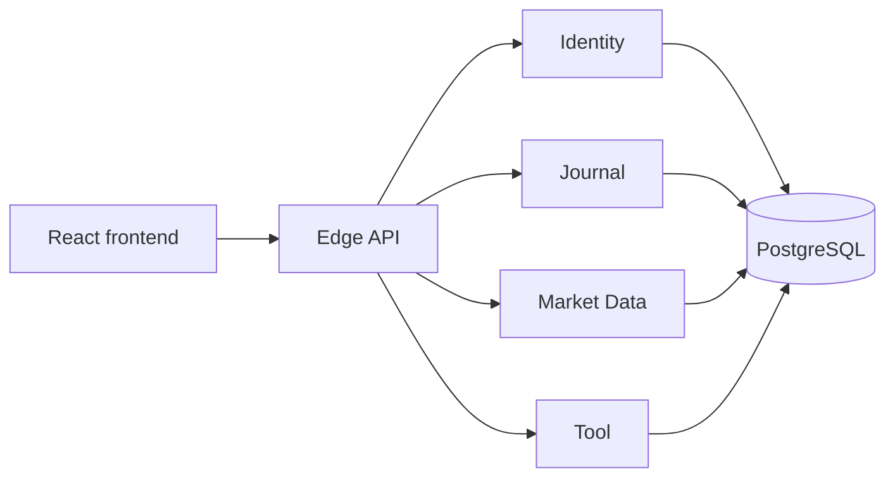

# Micro Cockpit

Micro Cockpit is a mobile-first market observation and self-review tool. Its primary record is a Market Observation for a personal Journal Day. Trades are optional evidence; the product is not a brokerage, portfolio ledger, live terminal, or automated judge.

## Product loop

1. Capture an Observation Update on Today.
2. Separate Signal from Interpretation and attach a market, theme, sector, or Instrument.
3. Record a testable Expectation and optional Action Decision or Trade evidence.
4. Review the Expectation Outcome and reasoning quality yourself.
5. Inspect recurring, evidence-linked patterns and choose Discipline Principles.

The authenticated navigation is exactly **Today, Review, Watchlist, Calendar, Tools, Settings**. Calculators remain public. Average Cost and Profit/Loss are standalone calculations; saved presets and Calculation Snapshots never imply holdings.

## Architecture


```mermaid
flowchart LR
    Browser[React frontend] --> Edge[Edge API]
    Edge --> Identity
    Edge --> Journal
    Edge --> Market[Market Data]
    Edge --> Tool
    Identity --> DB[(PostgreSQL)]
    Journal --> DB
    Market --> DB
    Tool --> DB
```

The browser calls only Edge. Identity, Journal, Market Data, and Tool are private services with least-privilege PostgreSQL roles. Schema ownership is normative in [`contracts/schema-ownership.json`](contracts/schema-ownership.json).

## Run locally

Copy [`.env.example`](.env.example) to an ignored `.env`, supply the required values, then:

```bash
docker compose up -d --build --wait
```

Frontend: `http://localhost:8080`
Edge health: `http://localhost:5099/health/ready`

## Verify

```bash
dotnet test TradeDiary.slnx
npm --prefix frontend test -- --run
npm --prefix frontend run build
npm --prefix frontend run lint
python3 scripts/validate-migrations.py
python3 scripts/validate-openapi.py
./tests/verify-architecture.sh
```

The manually dispatched E2E workflow starts the complete stack and runs the Market Observation release smoke, retired-route checks, and runtime database-role isolation.

Start with [PRODUCT.md](PRODUCT.md), the product source of truth; [CONTEXT.md](CONTEXT.md), the domain-language source of truth; and [ROADMAP.md](ROADMAP.md), the active roadmap. [DESIGN.md](DESIGN.md) and the [developer documentation index](docs/README.md) provide implementation guidance.
