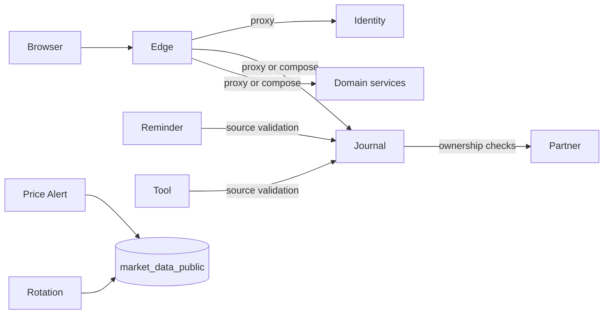
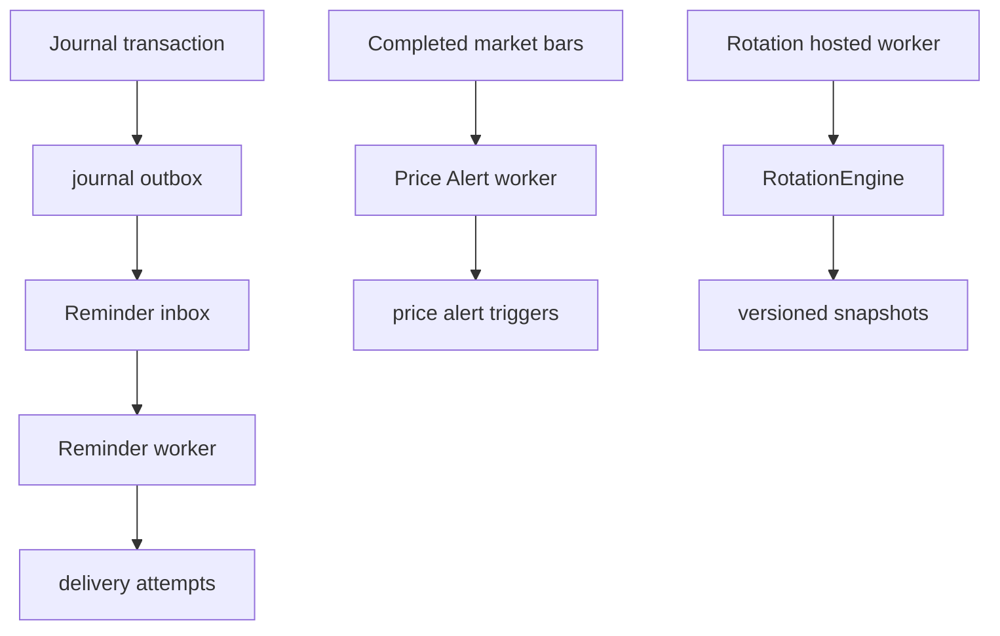

# Backend architecture

The backend consists of one public Edge API and thirteen private domain services. Services use ASP.NET Core minimal APIs and communicate through Edge-facing HTTP contracts, selected service-to-service HTTP calls, versioned events, or published database views.

## Request topology

Backend services are not browser-accessible in Compose or Kubernetes. Health and version endpoints exist on each service for orchestration.

## Edge responsibilities

| Component | Responsibility |
|---|---|
| `Program.cs` | Middleware order, JWT validation, authorization, rate limiting, downstream clients |
| `EdgeTransport.cs` | Header forwarding, bounded downstream timeout, JSON parsing, proxy responses |
| `AuthenticationEndpoints.cs` | Refresh-cookie boundary and session token shaping |
| `CockpitComposition.cs` | Dashboard, calendar, stock-page result composition and degradation rules |
| `Endpoints/*.cs` | Public route mapping, authorization policies, proxy or composition selection |
| `EdgeProblems.cs` | Stable RFC 7807 responses for downstream and local failures |

Simple routes use `MapProxy`. Composed routes deserialize downstream DTOs so optional failures can be represented explicitly. A downstream authentication failure is never treated as optional.

## Service ownership

See [Backend service catalog](../modules/backend-services.md) for every service, schema, endpoint family, and worker. The key rule is simple: a service writes only its schema. Runtime database roles enforce that rule.

## Authorization

Identity issues RS256 access tokens with `sub`, role, account type, and status version claims. Edge and private services validate those tokens. Edge applies product-area policies such as `diaryAccess`, `researchAccess`, and `admin`; services still apply ownership predicates when selecting user data.

Service-key protected routes exist for machine ingestion or jobs. Browser requests do not receive service keys.

## Background processing

Reminder and Price Alert workers use locked claims and uniqueness constraints to make retries safe. Rotation stores formula-versioned snapshots. Operations stores requested jobs and health history but is not a general job executor.

## Persistence and migrations

Services receive one role-specific connection string. Startup readiness checks confirm the database or required published view is available, but runtime services never create tables. The migrator verifies `manifest.json`, takes a PostgreSQL advisory lock, and records each migration checksum in its ledger.

## Failure behavior

- Invalid request bodies return `400` ProblemDetails.
- Missing and cross-user records generally both return `404`.
- Duplicate or idempotency conflicts return `409`.
- Edge maps downstream timeouts to `504`, network failures to `503`, and malformed typed responses to `502`.
- Optional BFF capabilities return explicit unavailable state only when the screen contract supports it.

## Change checklist

When adding an endpoint, update the service route, Edge mapping or composition DTO, generated OpenAPI, generated client, authorization tests, and [application API reference](../api/application-api.md). When persistence changes, append a migration and update [database schema](../database/schema.md).
