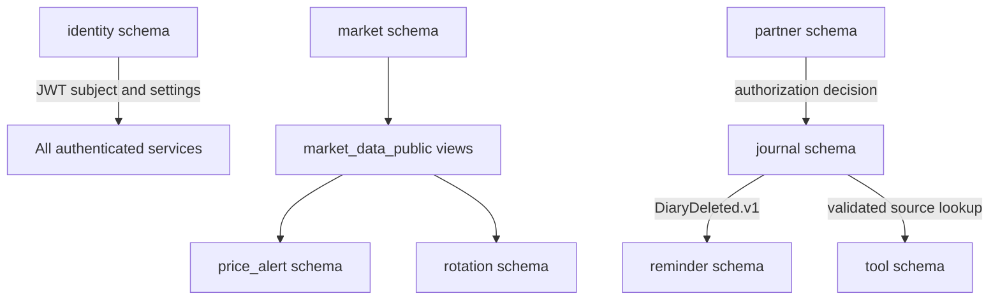

# Data ownership and cross-service flow

## Ownership model

Solid ownership boundaries matter more than physical database placement. No runtime service may write another schema. The two deliberate data-sharing mechanisms are versioned published views and service APIs.

## User-owned records

The authenticated JWT `sub` is the ownership key. User-owned tables include identity settings, diaries, transactions, reviews, performance, disciplines, reminders, watchlists, notes, alerts, partner links/policies, tool presets, and saved calculations.

Handlers do not trust browser-supplied user IDs. Queries derive the owner from the JWT and include `user_id` in reads, updates, and deletes. As a result, a valid UUID belonging to another user normally returns the same `404` as a missing UUID.

## Soft references

Tool calculations may record source diary and transaction UUIDs. These are intentionally not foreign keys across schemas. Tool service validates ownership through Journal before insertion, then stores a reconstructable calculation snapshot. If the source is deleted later, the snapshot remains understandable and the reference becomes historical.

Reminder uses a similar service boundary to validate diary ownership, but its lifecycle is also synchronized by `DiaryDeleted.v1` outbox/inbox processing.

## Derived values

| Value | Source |
|---|---|
| Daily performance percentage | Stored P/L divided by positive stored capital base |
| Tool result shown before save | Pure client calculation |
| Saved tool result | Server recalculation from schema-versioned inputs |
| Alert trigger | Published completed daily bar plus stored alert rule |
| Rotation rank and state | Versioned formula over published adjusted daily bars |
| Local date | Account IANA timezone resolved from current UTC time |

Missing financial data remains missing. The system does not substitute zero for absent P/L, price history, or lookback data.

## Portfolio boundary

There is no holdings table, lot ledger, trade execution model, or cost-basis engine. `journal.transactions` stores what a user recorded in a diary. It cannot answer authoritative questions such as current quantity, realized gain by lot, or broker cash balance. Average-cost inputs are therefore manual until a dedicated domain is introduced.
