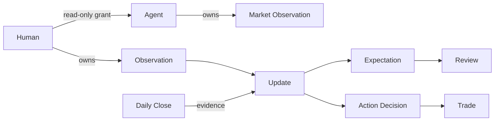

# Data ownership and flow

The authenticated `sub` claim is the owner key. Identity settings and Agent Users live in `identity`; Market Observation closures, Watchlists, grants, and sync logs live in `journal`; Instrument evidence lives in `market`; calculator persistence lives in `tool`.

```mermaid
flowchart LR
    Human -->|owns| Observation
    Agent -->|owns| AgentObservation[Market Observation]
    Human -->|read-only grant| Agent
    Observation --> Update
    Update --> Expectation
    Expectation --> Review
    Update --> Decision[Action Decision]
    Decision --> Trade
    Market[Daily Close] -->|evidence| Update
```

Ownership never moves. An Agent User reading a human grant cannot edit the human record. A comparison may place owners side by side but does not merge their conclusions.

Stable Instrument IDs survive symbol changes through `market.instrument_symbol_history`. Raw and adjusted completed-session values are separate published evidence fields.

Deletion removes personal rows in dependency order. Sync consumers receive only a record ID, record type, deletion time, operation, and version.
