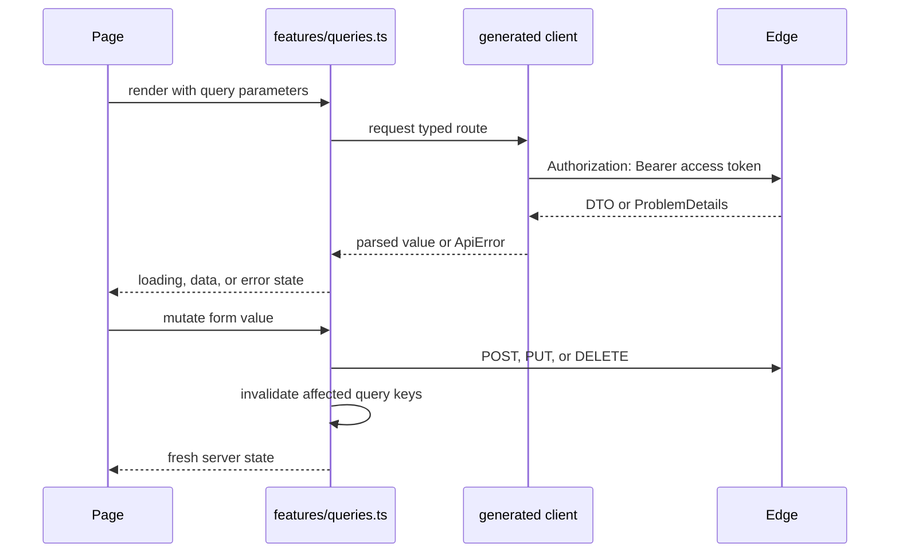

# Frontend architecture

The frontend is a React 19 application under `frontend/src`. It uses React Router for navigation, TanStack Query for server state, a generated OpenAPI client for HTTP, and CSS custom properties for the four visual theme combinations.

## Runtime layers

```mermaid
flowchart TD
    Main[main.tsx] --> QueryProvider[QueryClientProvider]
    QueryProvider --> Router[BrowserRouter]
    Router --> Auth[AuthProvider]
    Auth --> I18n[I18nProvider]
    I18n --> App[App routes]
    App --> Shell[AppShell or public layout]
    Shell --> Screen[Screen component]
    Screen --> Hook[Query or mutation hook]
    Hook --> FeatureAPI[features/api.ts or feature persistence module]
    FeatureAPI --> Generated[generated/edge.ts]
    Generated --> Edge[/api/*]
```

`main.tsx` applies mirrored appearance and locale before React paints, then installs the providers. `App.tsx` resolves public, anonymous-only, and authenticated routes. `shell.tsx` owns protected navigation and responsive chrome.

## Routes

| Route group | Main component | Data source |
|---|---|---|
| `/`, `/tools`, `/articles/*` | Landing, Tools, public content | Local catalog/calculation or anonymous Edge content |
| `/login`, `/register` | Auth screens | `/api/auth/*` |
| `/app` and `/app/calendar` | Today/dashboard and calendar | Typed Edge composition |
| `/app/diary/*` | Diary workspace and reviews | Journal proxy endpoints |
| `/app/stocks/*`, `/app/watchlist` | Research screens | Stock Research plus Market Data composition |
| `/app/price-alerts`, `/app/rotation` | Alert and rotation screens | Price Alert, Market Data, Rotation |
| `/app/partners` | Partner management and compare | Partner plus Journal composition |
| `/app/settings` | Account preferences and agent access | Identity through Edge |

Public tools share `/tools?tool=<id>`. Contextual source records use validated React Router state rather than IDs in the URL.

## Feature and state organization

| Location | Responsibility |
|---|---|
| `auth/AuthProvider.tsx` | Session state machine: restoring, authenticated, anonymous |
| `features/queries.ts` | Query keys, reads, mutations, and cache invalidation |
| `features/api.ts` | Handwritten domain wrappers around generated operations |
| `api.ts` | Token lifecycle, refresh, login, logout, generated-client configuration |
| `features/settingsWrites.ts` | Serializes settings writes to avoid stale concurrent preference updates |
| `features/appearance.ts` | Validates, mirrors, and applies scheme/accent preferences |
| `i18n` | Locale validation, mirrored startup locale, message lookup, error translation |
| `features/toolsCalc.ts` | Pure tool validation and calculations |
| `features/toolsWorkflow.ts` | Source-context and draft mapping |
| `features/toolsPersistence.ts` | Preset and saved-calculation HTTP operations |
| `ui.tsx` | Shared form controls, cards, buttons, feedback, and layout primitives |

TanStack Query owns remote cache only. Short-lived form state stays local to screens. Appearance and locale mirrors use `localStorage` solely to avoid startup flash; authentication tokens never use browser storage.

## Query lifecycle



Mutation hooks invalidate the narrowest stable keys plus composed pages affected by the write. For example, a diary update invalidates diary details, list/calendar/dashboard summaries, and relevant review data.

## Shared UI and theme

`ui.tsx` supplies reusable components. `App.css` and `index.css` define component styles and semantic tokens. The root document receives:

- `data-theme="light|dark"`
- `data-accent="green|red"`

Gain/loss colors are semantic variables and do not swap with the accent. This prevents a red accent theme from making profits appear as losses.

## Error handling

- Generated client failures become typed `ApiError` values.
- `i18n/errors.ts` maps stable ProblemDetails codes to user-facing messages.
- Query and mutation components render loading, empty, permission, and retry states where applicable.
- An unauthorized response attempts one refresh. If refresh fails, the client clears the access token and `AuthProvider` clears protected query state.

## Adding or changing a frontend feature

1. Confirm the Edge contract already exists or update the backend and regenerate contracts.
2. Add a feature API wrapper only when the generated method does not express the domain operation clearly.
3. Put server state in a query hook and declare all invalidations in the mutation hook.
4. Keep calculation and mapping logic outside the screen component.
5. Add route-level tests with MSW for navigation and mutation mapping, plus pure tests for calculations or parsers.
