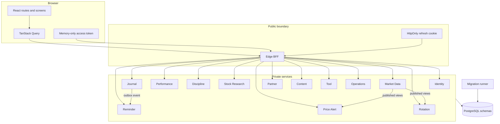

# Architecture overview

Micro Cockpit is a React single-page application backed by an ASP.NET Edge API and independently buildable ASP.NET services. All stateful services share one PostgreSQL instance but receive access only to their owned schemas.

## System structure

## Boundaries

### Frontend

The frontend calls `/api/*` on Edge through the generated client in `frontend/src/generated/edge.ts`. `frontend/src/api.ts` owns the in-memory access token and refresh behavior. Feature APIs and TanStack Query hooks sit above the generated client.

### Edge

`gateway/TradeDiary.EdgeApi/Program.cs` registers authentication, correlation, rate limiting, authorization, endpoint groups, and downstream HTTP clients. Edge has two endpoint styles:

- Direct proxy mappings for single-service operations.
- Typed composition for dashboard, calendar, stock pages, bootstrap, partner comparison, and selected review/rotation responses.

`EdgeTransport` converts timeouts, unavailable services, malformed payloads, and downstream statuses into stable ProblemDetails responses.

### Services

Each service is independently buildable and owns a focused domain. Most use ASP.NET minimal APIs in a single `Program.cs`. Service-local models and validation are often colocated with the endpoint definitions; calculation-heavy domains such as rotation and tools have separate engines or validation classes.

### Data

PostgreSQL is shared operationally, not logically. Each runtime role receives DML access to its schema. Cross-service access uses HTTP, an event contract, or an explicitly published database view. The deployment migration runner is the only component that applies schema changes.

## Where logic lives

| Logic | Location |
|---|---|
| Pure public tool calculations | `frontend/src/features/toolsCalc.ts` |
| Authoritative saved-tool recalculation | `services/tool-service/.../ToolValidation.cs` and `ToolModels.cs` |
| Tool workflow mapping | `frontend/src/features/toolsWorkflow.ts` |
| Query caching and invalidation | `frontend/src/features/queries.ts` |
| Session restoration and refresh | `frontend/src/api.ts`, `frontend/src/auth/AuthProvider.tsx`, Edge authentication endpoints |
| Screen composition | `gateway/TradeDiary.EdgeApi/CockpitComposition.cs` and endpoint classes |
| Diary ownership and idempotency | Journal service and `journal.idempotency_keys` |
| Rotation formulas | Rotation service `RotationEngine` |
| Alert evaluation | Price Alert and Reminder hosted workers |
| Schema evolution | `platform/postgres/migrations` plus the database migrator |

## Architectural strengths

- The browser has one API boundary and does not know service topology.
- Access tokens are memory-only; refresh credentials are HttpOnly cookies.
- User-owned queries include authenticated ownership predicates. Cross-user resources usually degrade to `404`.
- Database grants reinforce service ownership.
- Migration order and SQL checksums are committed and validated.
- Calculations are pure on the client, while saved results are recalculated on the server.
- Optional BFF dependencies distinguish unavailable data from valid empty data.

## Weak points and technical debt

- Many minimal-API services keep endpoints, SQL, validation, and DTOs in large `Program.cs` files. This is fast to navigate at small size but harder to review as services grow.
- The generated Edge OpenAPI document is large and creates noisy diffs.
- Backend builds currently report the known `Microsoft.OpenApi 2.0.0` security advisory `GHSA-v5pm-xwqc-g5wc`; dependency remediation remains outstanding.
- `ToolsPage.tsx` and `diary.tsx` coordinate substantial UI state; future features should avoid adding more unrelated branches to those components.
- Service-to-service source references in saved tool calculations are validated at write time but are soft references, not cross-schema foreign keys. Source deletion does not delete the calculation snapshot.
- There is no holdings or cost-basis domain. Any UI that claims current positions would be misleading.
- Background workers share process and deployment units with their HTTP APIs. Worker scaling and API scaling are therefore coupled.

## Related documents

- [Frontend architecture](frontend.md)
- [Backend architecture](backend.md)
- [Data ownership](data-flow.md)
- [Core flows](../flows/core-flows.md)
- [Architecture rationale](../explanation-architecture.md)
