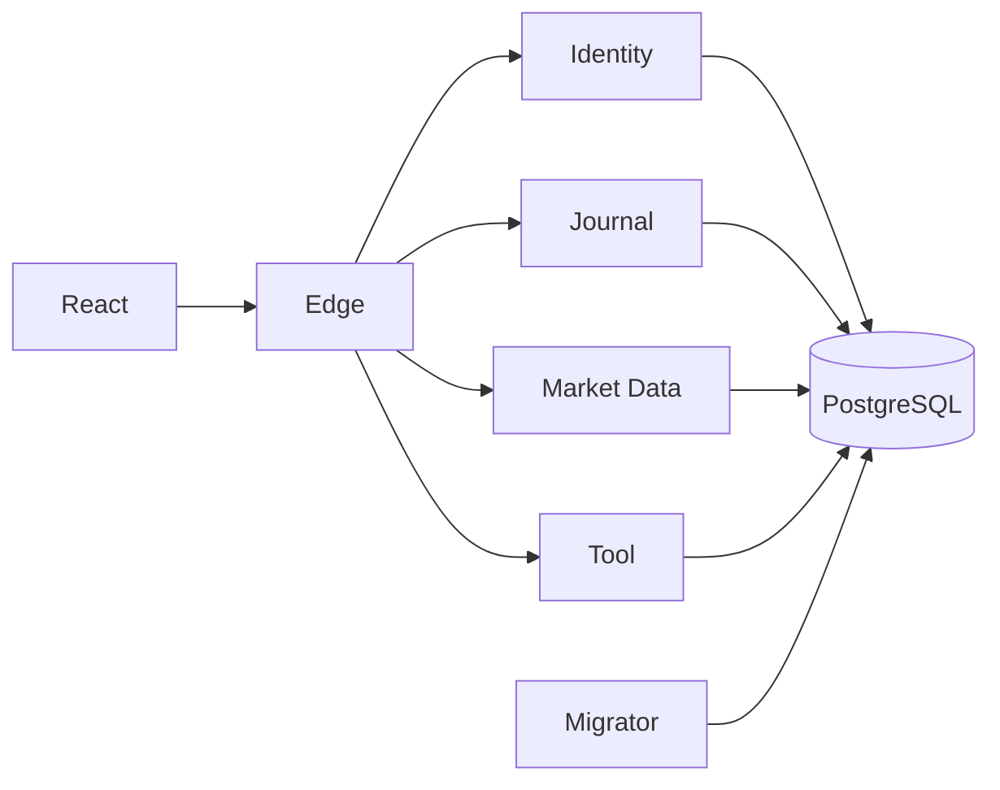

# Architecture overview

Micro Cockpit is a React application behind an ASP.NET Edge API and four private ASP.NET services. Stateful services share PostgreSQL operationally but have isolated schemas and roles.

```mermaid
flowchart LR
    React --> Edge
    Edge --> Identity
    Edge --> Journal
    Edge --> Market[Market Data]
    Edge --> Tool
    Identity --> DB[(PostgreSQL)]
    Journal --> DB
    Market --> DB
    Tool --> DB
    Migrator --> DB
```

The frontend calls the generated Edge client. Edge owns the refresh-cookie boundary, JWT authorization, correlation, downstream timeout behavior, direct proxy routes, Bootstrap, Settings, account export/deletion, and Calendar composition.

Identity owns accounts, sessions, Agent Users, and one active API token per Agent User. Journal owns the Market Observation model, Access Grants, and incremental sync. Market Data owns stable Instrument identity and completed-session price evidence. Tool owns presets and Calculation Snapshots.

Only the migrator applies schema changes. Runtime roles have DML on owned schemas, no DDL, and no access to the migration ledger. Cross-service reads use HTTP or published market views.

The OpenAPI-producing services explicitly pin `Microsoft.OpenApi 2.7.5` so
NuGet cannot fall back to the vulnerable `2.0.0` transitive minimum.
