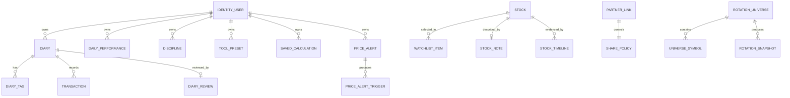
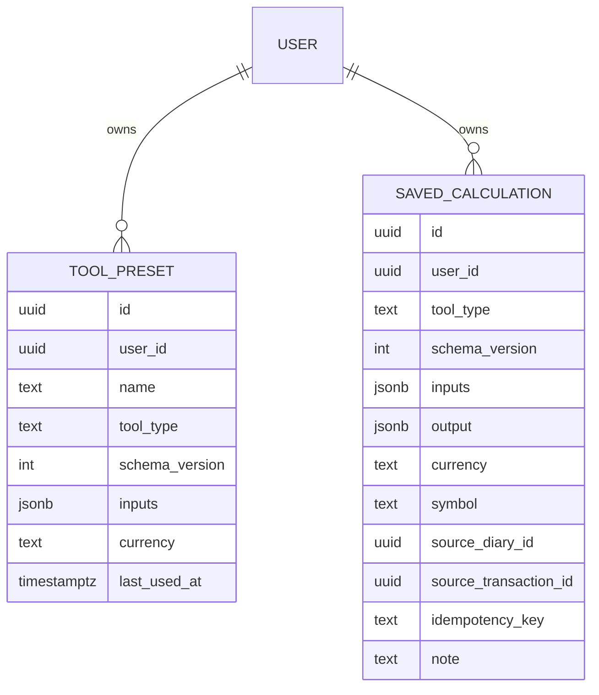

# Database and domain schema

Micro Cockpit uses one PostgreSQL database with schema and runtime-role isolation. Migrations are ordered in `platform/postgres/migrations/manifest.json`; runtime services never apply them.

## Schema ownership

| Schema | Owner service | Important entities |
|---|---|---|
| `identity` | Identity | users, credentials, refresh tokens, API keys |
| `journal` | Journal | diaries, tags, transactions, reviews, idempotency keys, outbox |
| `performance` | Performance | daily performance |
| `discipline` | Discipline | disciplines |
| `reminder` | Reminder | diary alerts, delivery attempts, event inbox/outbox |
| `stock_research` | Stock Research | stocks, watchlist items, notes, timeline records |
| `market` | Market Data | symbols, providers, ingestion runs, bars |
| `market_data_public` | Market Data published contract | versioned daily/adjusted bar views |
| `price_alert` | Price Alert | alerts, triggers |
| `rotation` | Rotation | universes, symbols, runs, rotation/breadth/state snapshots |
| `partner` | Partner | links, share policies, invitations |
| `content` | Content | posts, tags |
| `tool` | Tool | presets, saved calculations |
| `operations` | Operations | audit events, job registry, health history |

The exact ownership declaration used by validation tooling is `contracts/schema-ownership.json`.

## Core entity relationships

`IDENTITY_USER` relationships in this diagram represent UUID ownership, not cross-schema foreign keys. Services intentionally avoid cross-schema relational constraints.

## Journal domain

- `journal.diaries` is user-owned and local-date based. Deletion state is retained for event-safe lifecycle handling.
- `journal.diary_tags` uses a composite foreign key to diary plus user, preventing a tag from crossing ownership.
- `journal.transactions` belongs to diary and user and is indexed for user/symbol history.
- `journal.diary_reviews` is one review per diary/user with an ownership-preserving composite foreign key.
- `journal.idempotency_keys` scopes a request key by user and operation and stores payload/response identity.

Journal transactions do not form lots or holdings.

## Tool domain

Important constraints:

- Tool types are limited to the four retained calculator IDs.
- Schema version is currently `1`.
- Preset names are unique per user, case-insensitively.
- Saved idempotency keys are unique per user.
- Currency is three uppercase letters; symbol length is bounded.
- A source transaction cannot exist without a source diary.
- JSON is validated against tool-specific application schemas before insertion. It is not an arbitrary document store.

Source UUIDs are soft references. Tool service verifies them through Journal at save time instead of adding cross-schema foreign keys.

## Market and derived domains

Market Data owns raw/provider lifecycle and publishes named, versioned views. Price Alert and Rotation runtime roles receive read access only to those views, not to Market Data private tables.

- Price Alert triggers are unique by alert and trading date.
- Rotation batch runs are unique by universe, snapshot date, and formula version.
- Missing rotation lookback values remain null and carry `insufficient_data` status.

## Partner domain

Partner links prevent self-links and duplicate active pairs. Share policy is separate so each side can control exposure. Invitation code hashes are unique; raw codes are shown once and never stored. Status-specific check constraints keep redeemed and revoked rows structurally valid.

## Migration lifecycle

```mermaid
flowchart LR
    SQL[Append numbered SQL] --> Manifest[Add filename and SHA-256]
    Manifest --> Validate[Static and history validation]
    Validate --> Bootstrap[Create/alter runtime roles]
    Bootstrap --> Migrator[Acquire advisory lock]
    Migrator --> Tx[Apply migration and ledger row in one transaction]
    Tx --> Finalize[Apply grants and revoke broad access]
    Finalize --> Services[Start runtime services]
```

Never edit an applied migration. Append a new migration, preserve forward compatibility during deployment, and update this document when ownership or lifecycle changes.

See [Database migrations](../database-migrations.md) for commands and recovery procedures.
