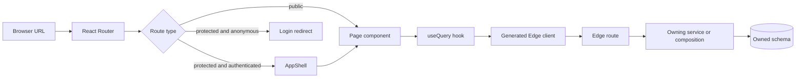
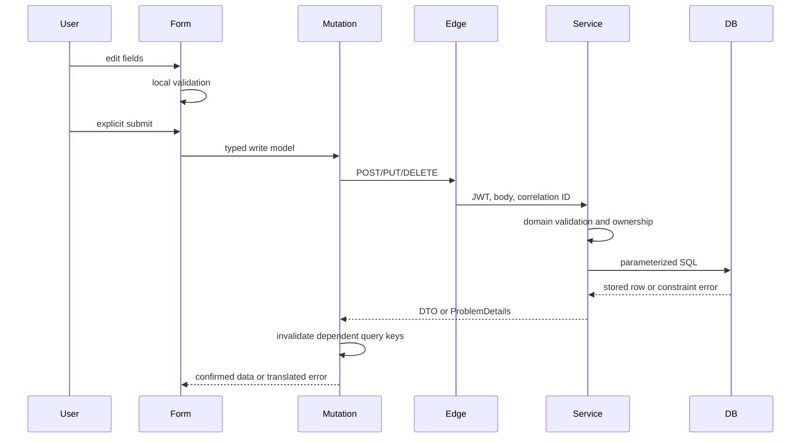
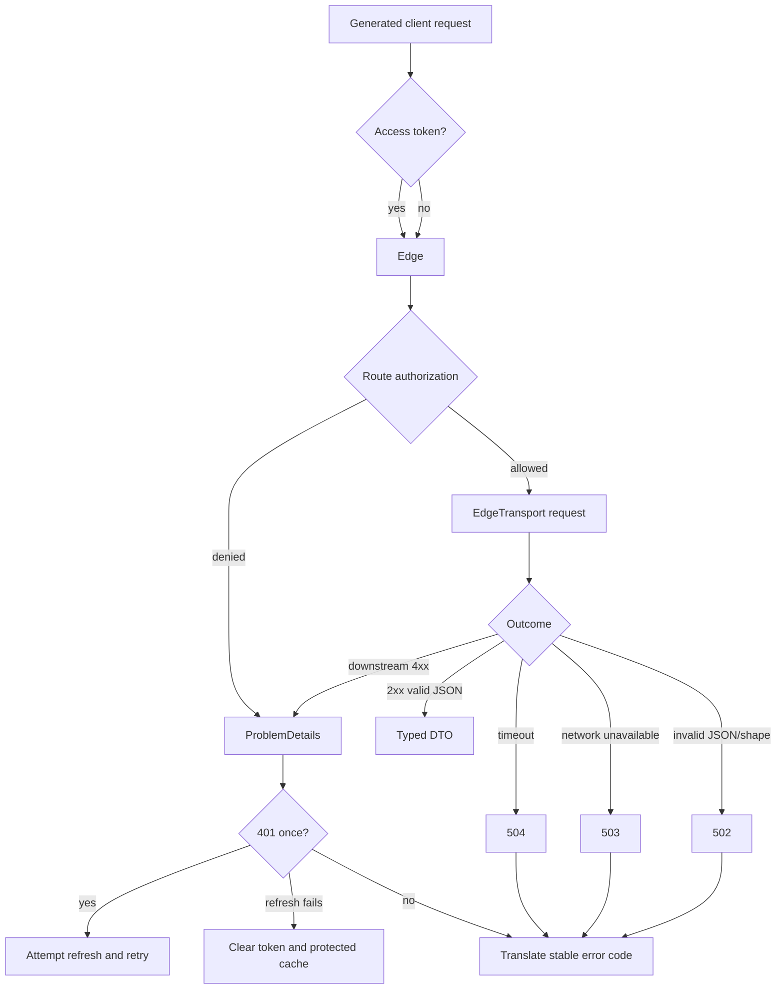
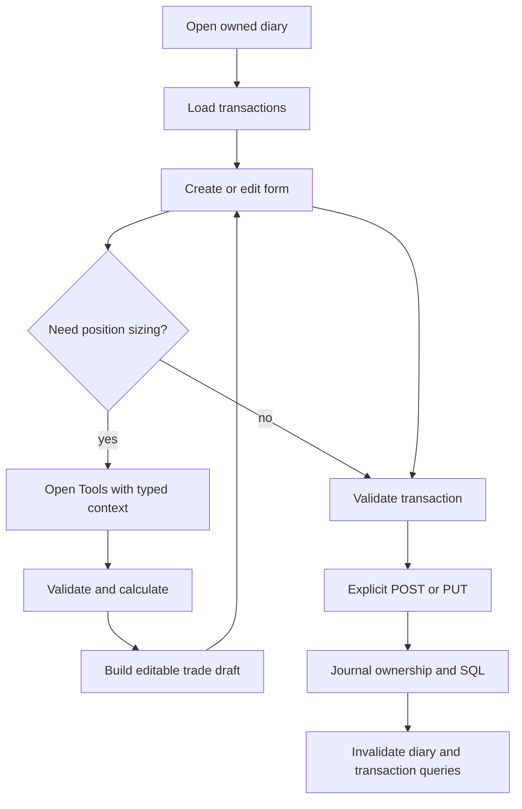
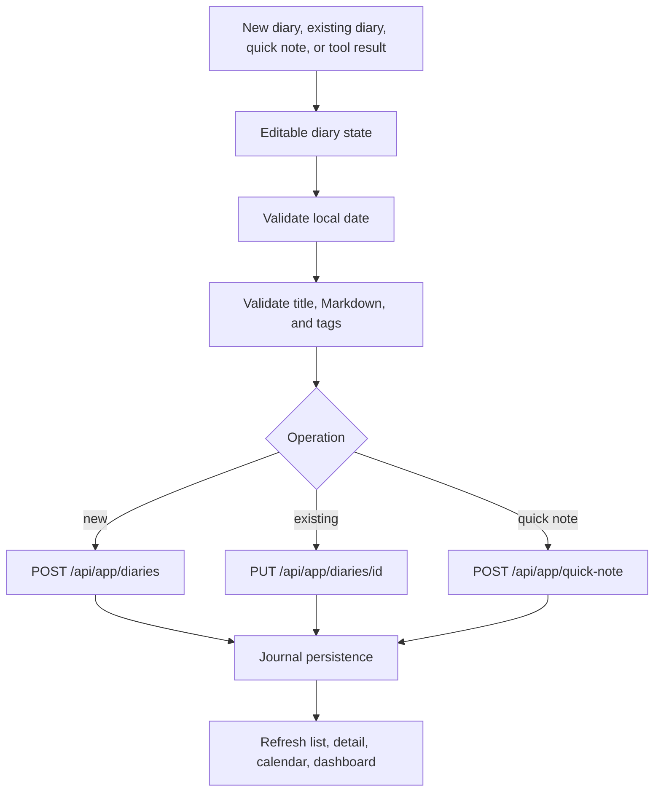
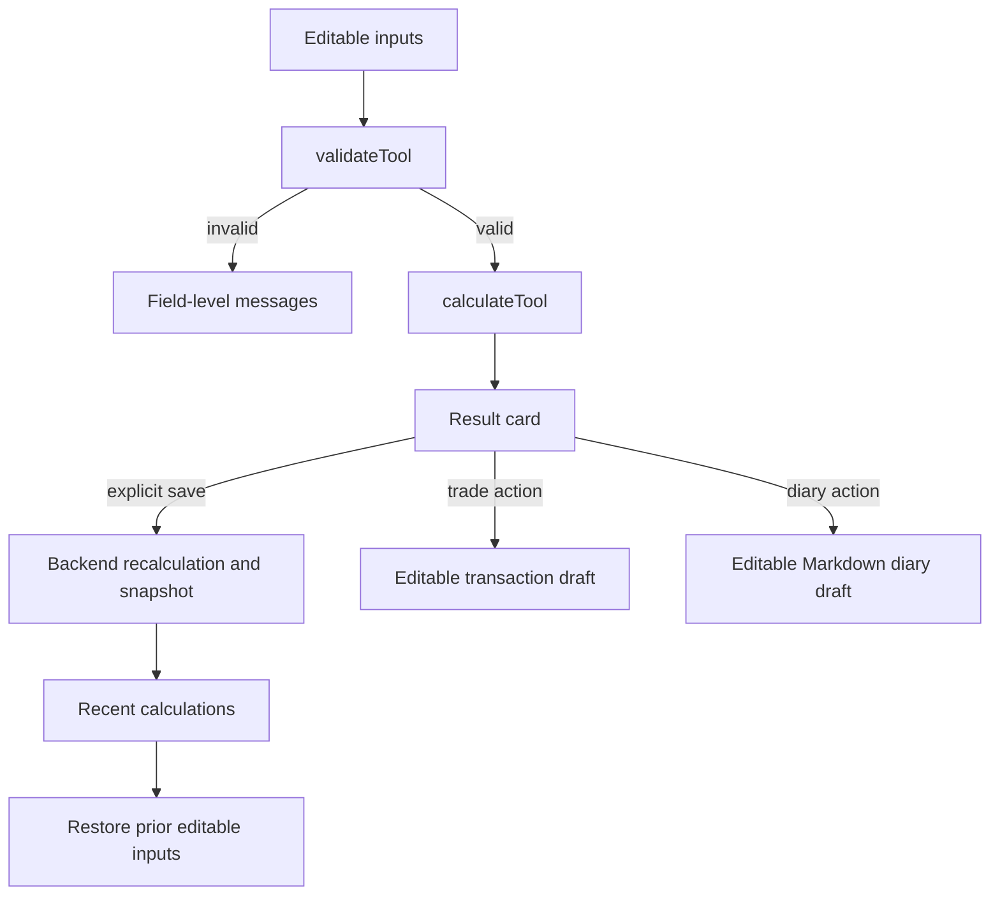
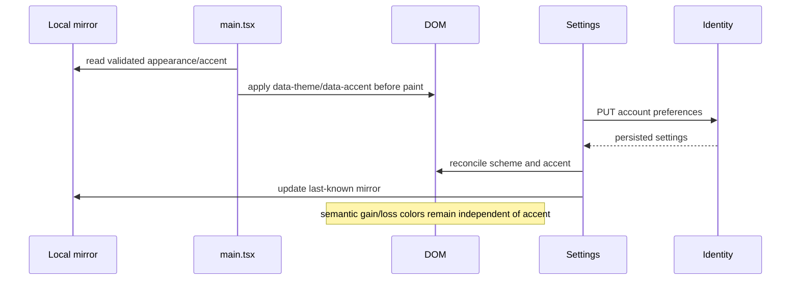
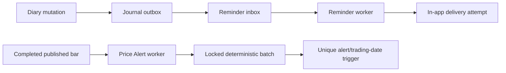

# Core flow diagrams

This page collects cross-cutting flows that span modules. Feature-specific diagrams live beside their module documentation.

## Authentication and session restoration

```mermaid
sequenceDiagram
    participant Browser
    participant Auth as AuthProvider
    participant Client as frontend/api.ts
    participant Edge
    participant Identity
    Browser->>Auth: application mounts
    Auth->>Client: restoreSession()
    Client->>Edge: POST /api/auth/refresh with td_refresh cookie
    Edge->>Identity: rotate refresh token
    alt valid token family
        Identity-->>Edge: access + new refresh token
        Edge-->>Client: access token; replace HttpOnly cookie
        Client-->>Auth: authenticated
    else invalid, expired, or reused
        Identity-->>Edge: 401
        Edge-->>Client: clear cookie, 401
        Client-->>Auth: anonymous
        Auth->>Auth: clear protected query cache
    end
```

The access token remains in JavaScript module memory. Only Edge can read or write the refresh cookie.

## Page route to data fetch



## Form submission to persistence



The frontend never treats optimistic form state as an authoritative persisted record. Tool-to-trade and tool-to-diary actions are drafts and still require this submit flow.

## API request and error lifecycle



## Trade creation and update



## Diary creation and update



## Tools input to action



## Theme selection and application



## Background alert processing



Worker retries are protected by inbox/event IDs, locked claims, and unique occurrence keys.
