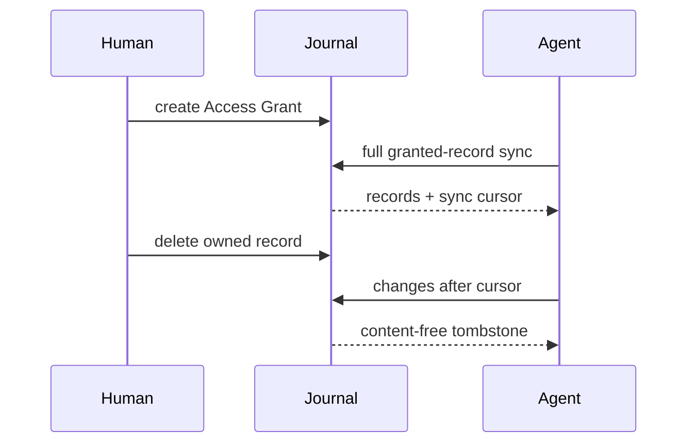

# Core flows

## Observation to self-review

```mermaid
flowchart LR
    Quick[Quick Observation] --> Update[Structured Update]
    Update --> Expectation
    Expectation --> Evidence[Daily Close evidence]
    Evidence --> Review[Owner chooses Outcome and reasoning quality]
    Review --> Pattern[Counts, denominators, evidence]
    Pattern --> Principle[Owner-selected Discipline Principle]
```

## Agent access and deletion

```mermaid
sequenceDiagram
    participant Human
    participant Journal
    participant Agent
    Human->>Journal: create Access Grant
    Agent->>Journal: full granted-record sync
    Journal-->>Agent: records + sync cursor
    Human->>Journal: delete owned record
    Agent->>Journal: changes after cursor
    Journal-->>Agent: content-free tombstone
```

## Session restoration

The access token stays in memory. On startup the frontend sends the HttpOnly refresh cookie to Edge; Edge rotates it through Identity and returns a new access token. A failed refresh clears the protected query cache.

## Calculators

Inputs are validated and calculated locally. Saving causes Tool to recalculate and persist a versioned snapshot. Reopening restores editable inputs. No calculator writes a Trade or Diary draft.
