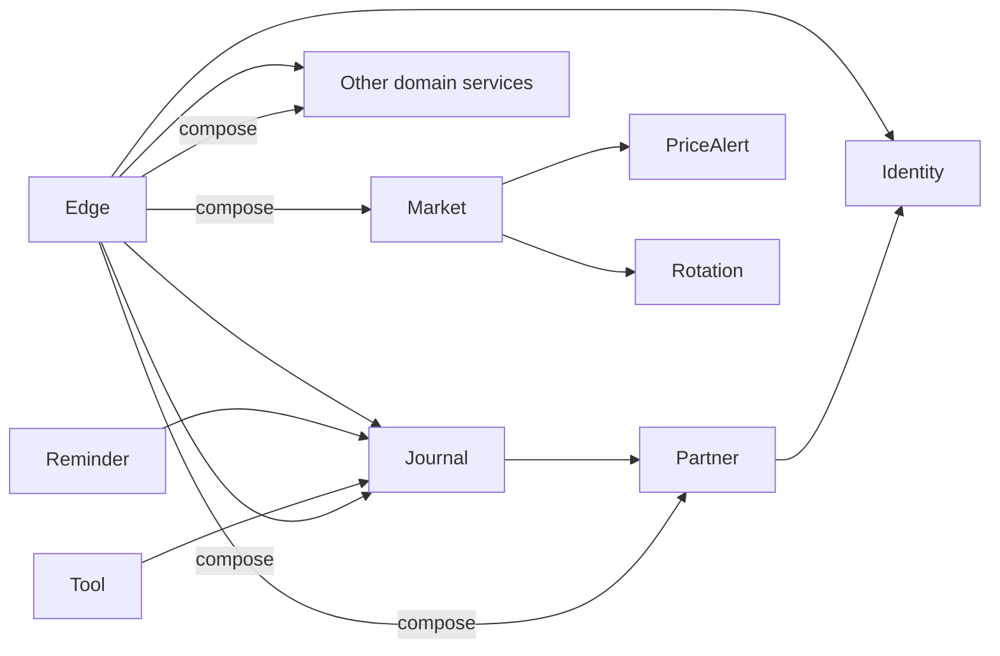

# Backend service catalog

Every backend capability is independently buildable. All services expose `/health/live`, `/health/ready`, and `/version`; the table focuses on domain routes and persistent ownership.

| Service | Owned schema | Main responsibility | Browser-facing route family | Worker or cross-service dependency |
|---|---|---|---|---|
| Identity | `identity` | Users, credentials, settings, JWTs, refresh tokens, agents/API keys | `/api/auth/*`, `/api/app/settings`, `/api/app/agents` | RSA signing key; no domain schema reads |
| Journal | `journal` | Diaries, transactions, reviews, tags, quick notes | `/api/app/diaries*`, `/api/app/quick-note`, review routes | Partner authorization; outbox to Reminder |
| Performance | `performance` | One manual daily P/L record per user/date | `/api/app/daily-performance/*` | None |
| Discipline | `discipline` | User disciplines and deterministic daily selection | `/api/app/disciplines*` | None |
| Reminder | `reminder` | Diary alerts, occurrences, delivery attempts, event inbox/outbox | `/api/app/diary-alerts*` | Hosted worker; validates diaries through Journal |
| Stock Research | `stock_research` | Stocks, watchlist, current note, append-only evidence timeline | `/api/app/stocks*`, `/api/app/watchlist*`, `/api/app/timeline*` | None |
| Market Data | `market`, `market_data_public` | Symbols, provider runs, daily bars, published price contracts | `/api/app/market/*`; service-key admin ingestion | Publishes views for Alerts and Rotation |
| Price Alert | `price_alert` | Alert rules and trigger history | `/api/app/price-alerts*` | Hosted worker reads published market view |
| Rotation | `rotation` | ETF universes and formula-versioned snapshots | `/api/app/rotation/*` | Hosted worker reads published adjusted bars |
| Partner | `partner` | Human/agent links, invitations, per-side sharing policy | `/api/app/partners*` | Identity display-name lookup; Journal compare composition |
| Content | `content` | Public educational posts and admin publishing | `/api/content/*`, `/api/admin/posts*` | None |
| Tool | `tool` | Calculator endpoints, presets, saved calculation snapshots | `/api/app/tools*`, `/api/app/tool-presets*`, `/api/app/saved-calculations*` | Validates optional sources through Journal |
| Operations | `operations` | Audit events, job registry, health history | `/api/admin/operations/*` | Admin-only records, not a general scheduler |

## Dependency overview

## Endpoint organization

Most services use Minimal API route maps in `services/<name>-service/src/<project>/Program.cs`. Edge endpoint groups live under `gateway/TradeDiary.EdgeApi/Endpoints`:

- `AuthenticationEndpoints`: login, refresh, logout, registration, agents.
- `BootstrapEndpoints`: current user and account context.
- `JournalEndpoints`: diary, transaction, review, and quick-note routes.
- `FeatureEndpoints`: performance, discipline, diary alerts.
- `ResearchEndpoints`: stock research, market, price alerts, rotation.
- `PartnerEndpoints`: partner lifecycle, invitations, compare composition.
- `AdminEndpoints`: tools, content, operations.
- `CompositionEndpoints`: dashboard, calendar, stock page.

## Non-obvious service rules

- Identity password hashes use PBKDF2-SHA256 with per-user salts. Refresh tokens are stored only as SHA-256 hashes and rotate once.
- Discipline's Today selection is stable for user plus local date; browsing randomly does not mutate it.
- Stock timeline records are append-only; corrections create a linked new record.
- Market providers push through service-key routes. Market Data does not fetch external providers itself.
- Price alerts use completed daily bars. Open evaluation means the open field of a completed bar, not a real-time market-open event.
- Rotation ranks within the configured universe or sector partition and stores the formula version.
- Partner human links are invitation-only. Cross-user or non-shared resources use non-disclosing failures.
- Content never stores private diary content.
- Operations records requested work but does not execute arbitrary jobs.

Service-specific details remain in each `services/*/SERVICE.md` file.
