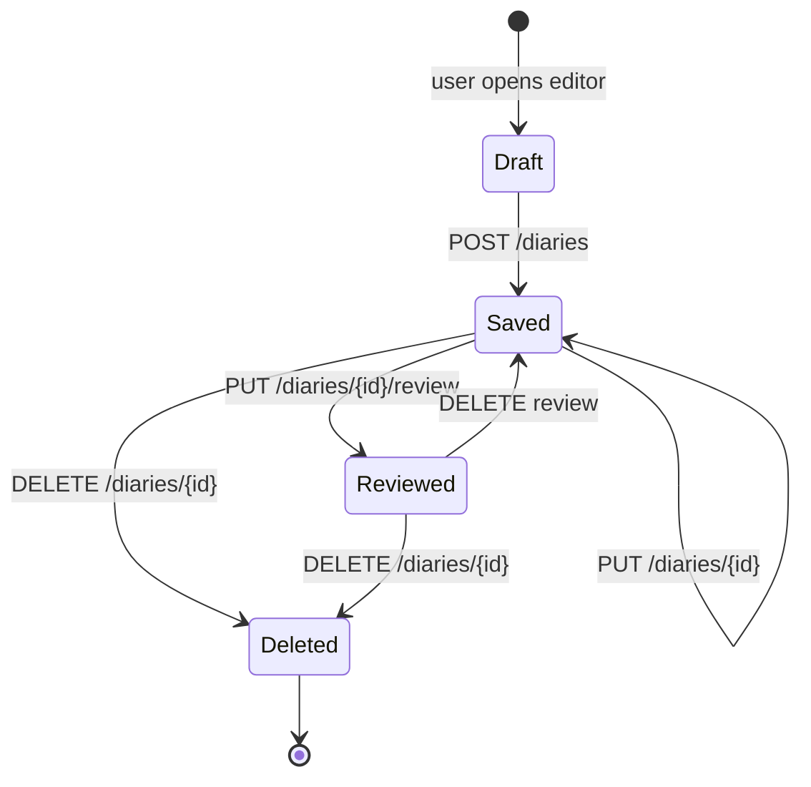
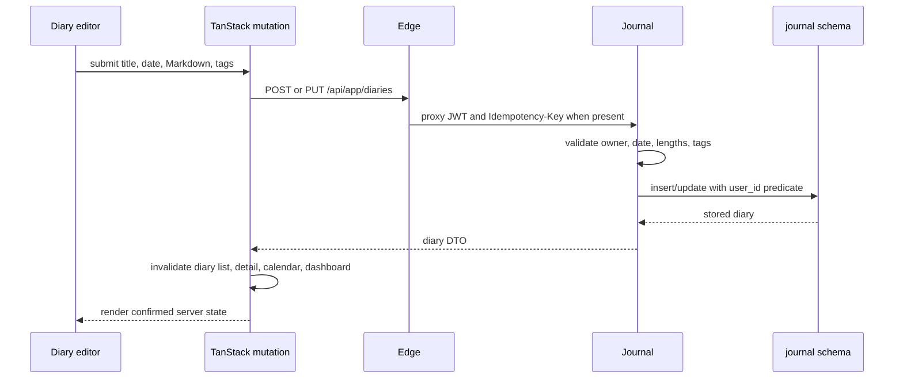
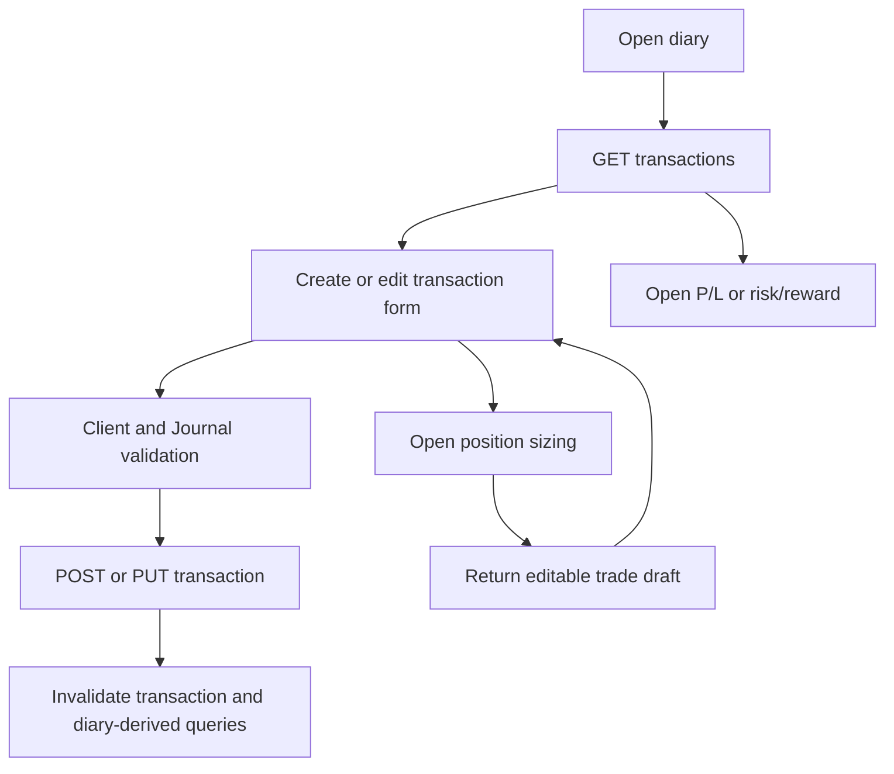
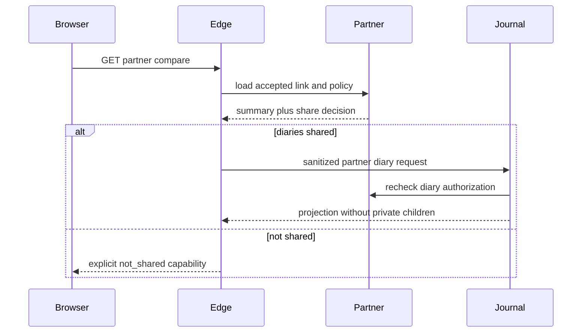

# Diary, transactions, and reviews

Journal is the core product domain. A diary belongs to one user and local date, contains Markdown content and tags, and may contain transaction records and one structured review. Transactions record the user's decision history; they are not broker executions or holdings.

## Main files

| File | Responsibility |
|---|---|
| `frontend/src/screens/diary.tsx` | Diary list/editor, transaction panel, review workflow, tool entry/draft return |
| `frontend/src/features/diaryFilters.ts` | URL/filter parsing for diary lists |
| `frontend/src/features/markdown.tsx` | Safe Markdown rendering configuration |
| `frontend/src/features/queries.ts` | Diary, transaction, review query and mutation lifecycle |
| `services/journal-service/.../Program.cs` | Ownership checks, CRUD, SQL, idempotency, partner projection |
| `platform/postgres/migrations/0001_*`, `0013_*`, `0015_*`, `0018_*` | Journal tables, idempotency, ownership FKs, tags/indexes |

## Diary lifecycle

Diary deletion is a soft-delete domain operation and publishes `DiaryDeleted.v1` through the Journal outbox so Reminder can clean up dependent alert behavior without cross-schema writes.

## Create or update flow

Creation supports an idempotency key. Repeating the same user, operation, key, and payload returns the prior response. Reusing a key with a different payload returns `409`.

## Transactions

Each transaction belongs to both a diary and its owner. Important fields are symbol, buy/sell side, quantity, price, currency, notes, and timestamps.

The tool-created draft only fills the form. The user must still submit the transaction. This prevents calculation actions from silently becoming trade records.

## Reviews

A diary review is a structured one-to-one child containing thesis, score fields, emotions, mistakes, and lessons. Review list and summary endpoints support retrospective views. Ownership is enforced with a composite `(diary_id, user_id)` foreign key.

Review mutations invalidate the diary detail, review detail, summaries, review-item lists, and diary lists because review state appears in multiple screens.

## Quick Note

Quick Note creates or appends to the diary for the resolved local date. The operation is deterministic and idempotent. It is the lightweight path for capturing an observation without opening the full editor.

## Partner projection

Partner compare never returns the complete diary object. Journal rechecks Partner authorization and selects only `id`, local date, title, content, and tags. Transactions, reviews, notes, user IDs, and idempotency metadata are excluded.

## Portfolio limitation

There is no portfolio or holdings module despite transaction-shaped data. Code and documentation must not derive current positions, FIFO/LIFO cost basis, realized P/L, or broker balances from diary transactions.
