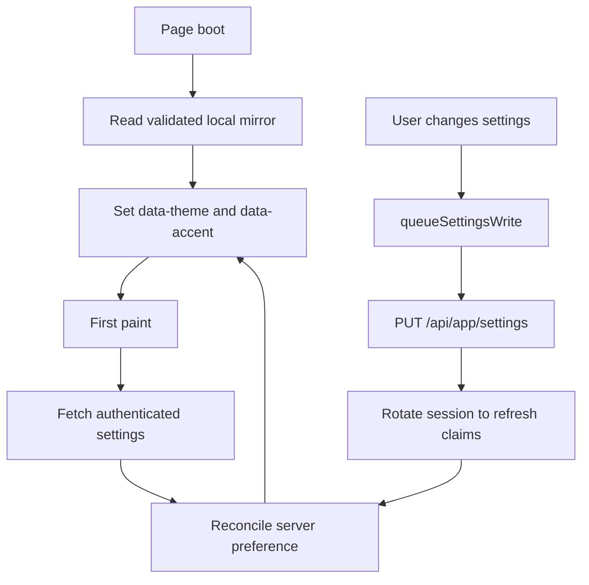

# Authentication, theme, shared UI, and API state

This module groups the frontend infrastructure used by every product screen: session state, request configuration, query state, localization, theme application, and UI primitives.

## Authentication responsibilities

| Entry point | Responsibility |
|---|---|
| `frontend/src/api.ts` | Holds the access token in module memory and configures refresh/unauthorized callbacks |
| `AuthProvider.tsx` | Converts restore/login/logout outcomes into React session state and clears protected caches |
| `LoginPage.tsx`, `RegisterPage.tsx` | Anonymous auth forms |
| Edge `AuthenticationEndpoints.cs` | Exchanges credentials, removes refresh token from JSON, manages HttpOnly cookie |
| Identity service | Password validation/hashing, refresh token rotation, JWT and API-key issuance |

The state machine has three values: `restoring`, `authenticated`, and `anonymous`. Protected routes wait during restoration so a page reload does not flash the login screen.

## API and query state

`frontend/src/generated/edge.ts` is generated and owns transport-level typing. `features/api.ts` names domain operations and adapts awkward generated shapes. `features/queries.ts` owns cache keys, fetch hooks, mutation hooks, and invalidation.

Do not call `fetch` directly from screens. Tool persistence has its own small feature module because it is shared by multiple controls on the Tools page, but it still uses the generated `request` transport.

## Theme system

Theme has two independent axes:

- Scheme: light or dark, with `system` as a stored preference.
- Accent: green or red.

The local mirror is not authoritative. It reduces theme and locale flash before authenticated settings arrive. Invalid stored values are ignored. Logout resets account-specific appearance and locale state.

## Settings serialization

`queueSettingsWrite` prevents rapid preference changes from racing. Writes execute in order, and each later write sees the current requested settings rather than an older response. After persistence, `useSaveSettingsMutation` refreshes the session because timezone and currency are token-backed account context.

If refresh fails after the settings write, persistence remains successful but the access token is cleared and the UI asks the user to sign in again. It does not rotate the refresh token twice.

## Shared UI

`frontend/src/ui.tsx` contains the common cards, buttons, inputs, select controls, status/error messages, and layout primitives. Components consume CSS variables rather than hardcoded theme colors. Feature screens should reuse these controls before adding new visual primitives.

## Localization and errors

`I18nProvider` supplies locale and message lookup. English and Traditional Chinese messages live under `i18n/messages`. Stable API problem codes are translated through `i18n/errors.ts`; raw server exception text is not shown to users.

## Side effects to remember

- Ending a session clears the full TanStack Query cache.
- Saving settings can change document attributes and locale immediately.
- Theme and locale mirrors write to localStorage; access tokens never do.
- Query mutations may refetch composed pages beyond the directly changed record.
