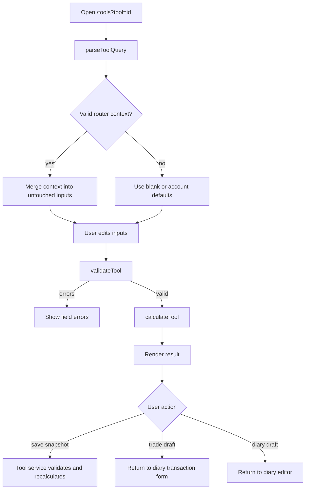
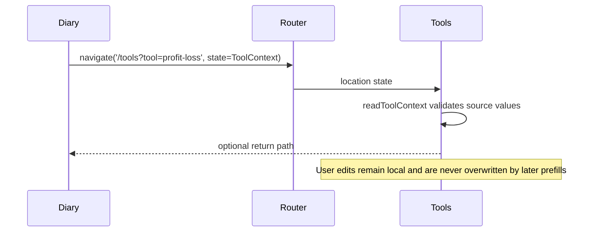
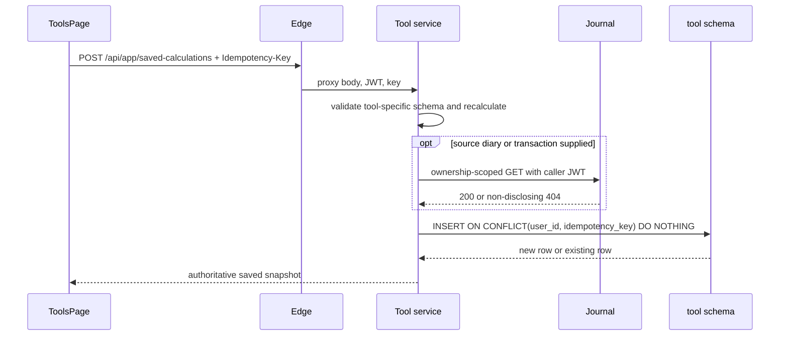

# Tools module

The Tools module exposes four retained calculators: position sizing, risk/reward, average cost, and profit/loss. Anonymous users can calculate locally. Authenticated users can also save presets and calculation snapshots. Contextual entry points can create editable trade or diary drafts.

## Main files

| File | Responsibility |
|---|---|
| `frontend/src/features/toolsCalc.ts` | Tool IDs, validation codes, pure calculations |
| `frontend/src/features/toolsCatalog.ts` | Public catalog metadata and query-string routing |
| `frontend/src/features/toolsWorkflow.ts` | Validated source context and result-to-draft mappings |
| `frontend/src/features/toolsPersistence.ts` | Typed preset and calculation persistence calls |
| `frontend/src/screens/tools/ToolsPage.tsx` | Forms, results, context banner, presets, history, actions |
| `services/tool-service/.../ToolModels.cs` | Backend input and result records, authoritative formulas |
| `services/tool-service/.../ToolValidation.cs` | Per-tool JSON schema checks and server recalculation |
| `services/tool-service/.../ToolStore.cs` | User-scoped SQL and idempotent saves |
| `platform/postgres/migrations/0024_tool_workflows.sql` | `tool.presets` and `tool.saved_calculations` |

## Calculation flow

`calculateTool` is deterministic and has no HTTP, storage, date, or React dependency. Backend response formulas mirror it, but saved calculations use only the backend result as the persisted output.

## Context contract

`ToolContext` is React Router state. It contains a strict tool ID, editable string inputs, optional symbol/currency/date, a user-facing source label, a safe internal return path, and optional source UUIDs.

`readToolContext` rejects:

- A context intended for another tool.
- Unknown tool IDs or non-object inputs.
- Non-positive numeric values, except fees which may be zero.
- Invalid side, currency, symbol, or date values.
- External or protocol-relative return paths.

Source IDs are not placed in the URL. Clearing context removes the source relationship but leaves the calculator usable.

## Important function reference

| Function | Contract and impact |
|---|---|
| `parseToolQuery(value)` | Returns a retained `ToolId`; invalid or missing input falls back to position sizing. |
| `validateTool(tool, values)` | Returns field-to-error-code mappings. It never mutates inputs or throws. |
| `calculateTool(tool, values)` | Revalidates, throws `ToolInputError` on invalid input, and returns rounded numeric output. |
| `readToolContext(state, expectedTool)` | Treats navigation state as untrusted and returns either a normalized context or `null`. |
| `toolContextForTrade` | Maps a journal transaction to profit/loss inputs. Buy maps to long, sell maps to short. Fees start at zero. |
| `toolContextForRiskReward` | Maps only the known entry price. It does not invent stop or target prices. |
| `toolContextForPositionDraft` | Maps valid draft symbol, currency, and entry price; empty/invalid values are omitted. |
| `buildTradeDraft` | Maps applicable result quantity and entry values to an editable buy draft and adds a review warning. |
| `buildDiaryDraft` | Produces Markdown assumptions, the primary result, decision note, and ISO timestamp. |
| `persistedInputs` / `editableInputs` | Convert form strings to versioned JSON values and back without coupling UI controls to API DTOs. |
| `ToolValidation.TryCalculate` | Deserializes the payload for its declared tool, validates it, recalculates output, and returns false on malformed input. |
| `ToolStore.Save` | Inserts a user-owned snapshot or returns the existing row for the same user/idempotency key. |
| `SourceReferenceValidator.Owns` | Forwards the caller bearer token to Journal and accepts only a successful source lookup. |

## Formulas and rules

### Position sizing

`risk budget = account value × risk percent / 100`

`quantity = floor(risk budget / abs(entry price - stop price))`

Account value, risk percentage, entry, and stop must be positive. Risk percentage cannot exceed 100. Entry and stop cannot match.

### Risk/reward

Long: `stop < entry < target`. Short: `target < entry < stop`.

`ratio = abs(target - entry) / abs(entry - stop)`

### Average cost

`average cost = (current quantity × current average + added quantity × added price) / total quantity`

All four inputs must be positive. Inputs are manual because Cockpit has no holdings ledger.

### Profit/loss

`gross P/L = (exit - entry) × quantity × direction`

`net P/L = gross P/L - entry fee - exit fee`

Direction is `1` for long and `-1` for short. Prices and quantity must be positive; fees may be zero.

## Persistence flow

Preset inputs may be partial because presets represent reusable assumptions. Saved calculations require complete valid inputs. Applying a preset never submits a calculation.

## Limitations

- Only position sizing and risk/reward map naturally to trade drafts.
- Average cost cannot prefill from holdings because holdings do not exist.
- Saved source references are soft and may become stale after source deletion.
- Formula schema version is currently `1`; future formula changes must preserve old reconstruction semantics or add a new version.
